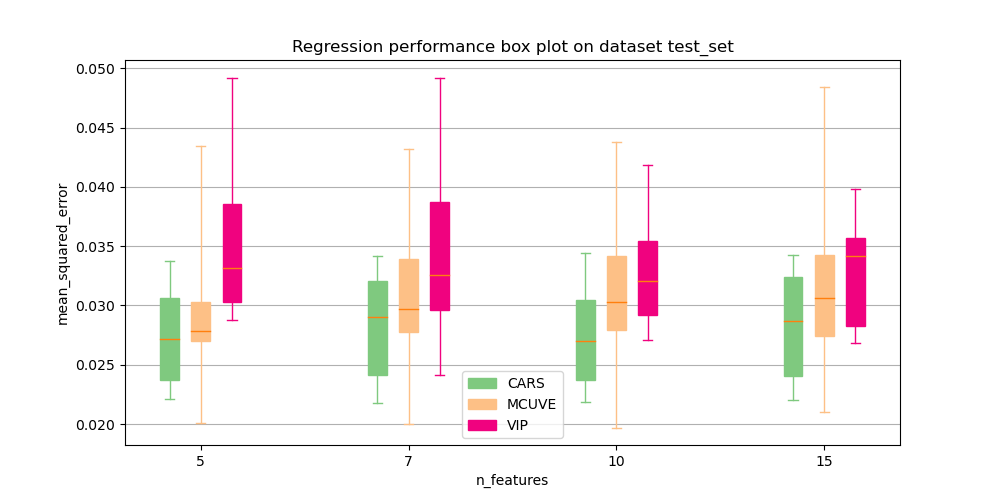
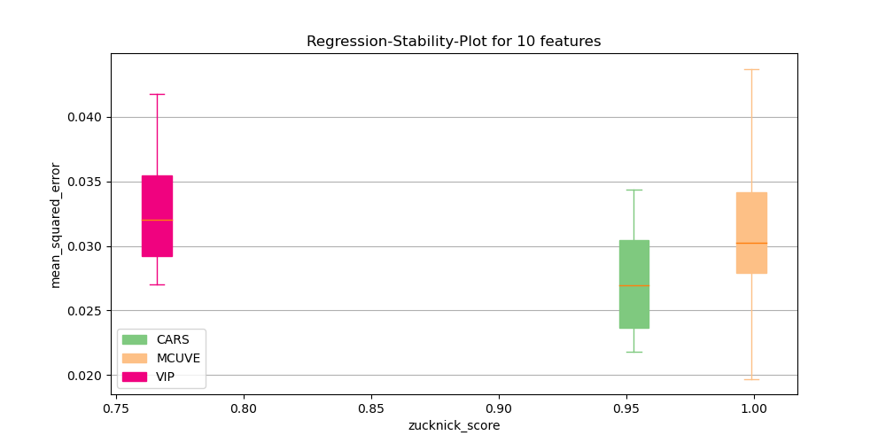
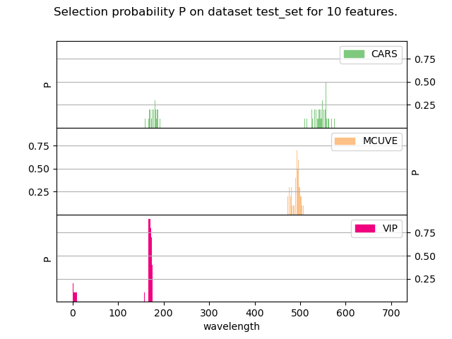

.. currentmodule:: auswahl

.. |br| raw:: html

  

============
Benchmarking
============

This guide provides an overview of the most important functionality of the benchmarking facilities provided by **Auswahl**.
The benchmarking is intended to provide **Auswahl** with a native mean of a quick and out-of-the-box evaluation and comparison
of different selector algorithms. The main component of the benchmarking framework is the function :func:`~auswahl.benchmarking.benchmark`.
The first parts of this guide will elaborate on the interface of the function :func:`~auswahl.benchmarking.benchmark`,
while the remaining parts will showcase the handling of the results generated by the benchmarking function. We recommend
to get a quick overview of the documented interface of :func:`~auswahl.benchmarking.benchmark` before proceeding with this guide.

Data sets
=========

The benchmarking system can evaluate the performance of :class:`~SpectralSelector` methods across several data sets simultaneously in order to provide a
unified comparison of selection algorithms across a number of studied scenarios.
The data set configurations provided to the benchmarking function each consist of a tuple specifying four items. Namely

    * The spectral data as :class:`~numpy.ndarray` of shape (n_samples, n_features)
    * The target quantities as :class:`~numpy.ndarray` of shape (n_samples)
    * The unique name of the data set
    * a float in :math:`]0,1[` indicating the share of the data to be used for fitting of the selection algorithms

An example invocation of :func:`~benchmarking.benchmark` with several data sets is given below::

    result = benchmark(data=[(X, y, 'first dataset', 0.90),
                             (X2, y2, 'second_dataset', 0.8)],
                       features=[10, 15, 20],
                       methods=[CARS(), VIP()],
                       n_runs=10)

Selectors
=========

The benchmarking system can handle all selectors extending the class :class:`~SpectralSelector`. Especially, the system can benchmark algorithms of
the subclasses :class:`~PointSelector` and :class:`~IntervalSelector` simultaneously. In the data handling of the benchmarking system
and all derived functionalities, such as the plotting, the selectors are addressed by their class name. If these are not unique
(for instance during benchmarking of differently configured instances of the same selector algorithm),
or custom names are desired for other reasons, the names can be specified for the selectors as exemplified below::

    result = benchmark([(X, y, 'data_example', 0.25)],
                       features=[10, 15, 20],
                       # provide unique names here
                       methods=[(CARS(), "first_cars"), (CARS(n_cars_runs=10), "second_cars")],
                       n_runs=10)

Features to select
==================

The benchmarking system allows the comparison of feature selection algorithms across several feature configurations.
For the :class:`~PointSelector` the configurations of features to be selected are simply specified by a single integer. For selectors extending :class:`~IntervalSelector`
a feature selection configuration requires the description of both the width of an interval (that is a consecutive block of wavelengths) and a number of
such intervals to be extracted by the algorithm. Such a configuration is specified with a tuple (number of intervals, interval width). If the methods to be benchmarked
comprise at least one selector extending :class:`~IntervalSelector`, all feature configurations need to be specified in the above defined interval fashion. For
:class:`~PointSelector` the interval configurations will be resolved by selecting :math:`intervals \times width` many features.
An example for such a scenario is given below::

    result = benchmark([(X, y, 'data_example', 0.25)],
                        #The IntervalSelector FiPLS is benchmarked. Specify the feature configurations for which the algorithms
                        #are to be tested as intervals (#intervals, interval width)
                       	features=[(10, 5), (20, 5), (5, 10)],
                        methods=[CARS(), FiPLS()],
                        n_runs=10)

Metrics
=======

The benchmarking system distinguishes between two different kinds of metrics, namely *regression metrics* and *stability metrics*.
While the former is a compulsory component of the benchmarking (and set to :func:`sklearn.metrics.mean_squared_error` per default),
the *stability metric* is optionally calculated by the benchmarking system. The system can handle several metrics of each kind simultaneously.

Regression Metrics
------------------

The benchmarking system can handle all regression metrics, which follow the convention of the metric functions of sklearn, such as
:func:`sklearn.metrics.mean_squared_error` or :func:`sklearn.metrics.mean_absolute_error`.

Stability Metrics
-----------------

The *stability* is a metric quantifying the degree of feature fluctuation of feature selection
algorithms across several executions with equal or varying data splits.
The stability is a well-established characteristic considered
in the feature selection literature and often juxtaposed with the regression quality of the features selected by an algorithm.
It can be argued, that the stability of a selection algorithm is a confluence of both the amount of randomization deployed in the algorithm and
the degree to which randomization is modulated by the algorithm through feedback from interactions with the data.
This might allow for many or few different sets of features with high explanatory power, depending on its characteristics.
Some of these characteristics of data are innate to their acquisition domain.
An ubiquitous property of spectral data is its high degree of multicollinearity, that is a high degree of linear dependence and redundancy
between different features. The more conventional stability metrics, which are based on set-theoretical considerations such as the Intersection-over-Union, can therefore be considered as not entirely adequate for the stability assessment
in the regime of spectral feature selection and many other domains. The set-theoretical approaches have therefore been
complemented with metrics introducing correlation-adjustment mechanisms into the stability
evaluation. |br|
For the benchmarking functionality provided in **Auswahl**, two stability assessment metrics are provided directly.

Deng Score
^^^^^^^^^^

The Deng-score is a set-theoretical stability measure without any means of correlation-adjustment.
The metric considers two sets of selections of features :math:`S_1` and :math:`S_2` of size :math:`n` out of :math:`N` features
and quantifies the degree of overlap adjusted by the expected random overlap :math:`e = \frac{n^2}{N}`

.. math:: \mathcal{S}_{deng}(S_1, S_2) = \frac{S_1 \cap S_2 - e}{n - e}

For sets of selections :math:`\{S_i\}_{i=1}^k`, the score is averaged across all pairs

.. math:: \mathcal{S}_{deng}(\{S_i\}_{i=1}^k) = \frac{2}{k^2 - k}\displaystyle\sum_{i < j}\mathcal{S}(S_i, S_j)

The metric is available for benchmarking with class :class:`~benchmarking.util.metrics.DengScore`

.. topic:: References:

    * Bai-Chuan Deng, Yong-Huan Yun, Pan Ma, Chen-Chen Li, Da-Bing Ren and Yi-Zeng Liang,
      'A new method for wavelength interval selection that intelligently optimizes the locations, widths
      and combination of intervals',
      Analyst, 6, 1876-1885, 2015.

Zucknick Score
^^^^^^^^^^^^^^

The Zucknick score aims to account for the high collinearity in spectral data, by incorporating a correlation adjustment mechanism into the stability evaluation.
To that end the Zucknick-Score considers the Intersection-over-Union adjusted with a correlation contribution :math:`C`.
The metric considers two sets of selections of features :math:`S_1` and :math:`S_2` of size :math:`n`:

.. math:: \mathcal{S(\delta)}_{zucknick} = \frac{S_1 \cap S_2 + C(S_1, S_2, \delta)}{S_1 \cup S_2}

where :math:`C` is defined as

.. math:: C(S_1, S_2, \delta) = f(S_1, S_2, \delta) + f(S_2, S_1, \delta)

where in turn :math:`f` is defined as

.. math:: f(S_1, S_2, \delta) =
            \begin{cases}
                0       & \quad \text{if } |S_1 \backslash S_2| = 0\\
                \frac{\|X(S_1 \backslash S_2, S_2) \odot t(X(S_1 \backslash S_2, S_2), \delta)\|}{n}  & \quad \text{else}
            \end{cases}

where :math:`X(S_1, S_2)` is the correlation matrix between the features in :math:`S_1` and :math:`S_2`, :math:`\odot` the elementwise multiplication
and :math:`t(X, d)` a thresholding function operating on matrix :math:`X` using threshold :math:`d`, such that

.. math:: t(X, d)_{i,j} = \begin{cases}
    				0       & \quad \text{if } X_{ij} < d\\
    				X_{ij}  & \quad \text{else}
  			  \end{cases}

The parameter :math:`\delta` can be selected by the users as a threshold for the minimum required correlation between
two features for them to be considered similar.

For sets of selections :math:`\{S_i\}_{i=1}^k`, the score is averaged across all pairs

.. math:: \mathcal{S}_{zucknick}(\{S_i\}_{i=1}^k) = \frac{2}{k^2 - k}\displaystyle\sum_{i < j}\mathcal{S}(S_i, S_j)

The metric is available for benchmarking with class :class:`~benchmarking.util.metrics.ZucknickScore`

.. topic:: References:

    * Zucknick, M., Richardson, S., Stronach, E.A.: Comparing the characteristics of
      gene expression profiles derived by univariate and multivariate classification methods.
      Stat. Appl. Genet. Molecular Biol. 7(1), 7 (2008

Adding Stability Metrics
^^^^^^^^^^^^^^^^^^^^^^^^

In order to add custom stability metrics to the benchmarking system, the inheritance from :class:`~benchmarking.util.metrics.StabilityScore`
and the implementation of :meth:`~auswahl.benchmarking.util.metrics.StabilityScore.evaluate_stability` is mandatory.
For stability metrics defined as average over symmetric stabilities between pairs of sets of selected features,
consider extending the class :class:`~benchmarking.util.metrics.PairwiseStabilityScore`::

    class MyScore(PairwiseStabilityScore):

        def __init__(self, metric_name, *my_args, **my_kwargs):
            super().__init__(metric_name)

        def pairwise_sim_func(self, meta_data: dict, set_1: np.ndarray, set_2: np.ndarray) -> float:

            #
            # Calculate the stability between the pair of feature sets set_1 and set_2
            #

            # access meta information of the data set, if required
            total_number_of_features = meta_data['n_features']
            return 0

The user is only required to overwrite the method :meth:`~benchmarking.util.metrics.PairwiseStabilityScore.pairwise_sim_func` to calculate and return
the stability between a pair of sets of selected features. If the stability calculation requires information about the dataset (such as correlation information), the
data can be accessed via the provided ``meta_data``. See :class:`~benchmarking.DataHandler.get_meta` for an overview over the returned data.

If there is no recourse to the superclass :class:`~benchmarking.util.metrics.PairwiseStabilityScore`, the
method :meth:`~auswahl.benchmarking.util.metrics.StabilityScore.evaluate_stability` provides the user
with an array of all selections.

Using Metrics
^^^^^^^^^^^^^

The evaluation metrics can be passed as lists if the evaluation of several metrics is desired.
When accessing the results of the evaluation, the regression metrics are referred to by their function name. The stability
metrics can be arbitrarily named, but are per default named with their camelcase class name separated by an underscore (like ``zucknick_score``).
An example invocation can be seen here::

    result = benchmark([(X, y, 'data_example', 0.25)],
                       features=[10, 15, 20],
                       reg_metrics=[mean_squared_error, mean_absolute_error],
                       stab_metrics=[DengScore(), ZucknickScore(metric_name='custom_name',
                                                                correlation_threshold=0.9)]
                       methods=[CARS(), VIP()],
                       n_runs=10)

Benchmarking Results
====================

This section elaborates on the structure and further handling of the data returned by the benchmarking.

Output structure and retrieval
------------------------------

The function :func:`~auswahl.benchmarking.benchmark` returns the results of the evaluation as an instance of class :class:`~auswahl.benchmarking.DataHandler` which
aggregates the evaluation results curated into four categories:

**Regression**

Regression results for all selection algorithms, all benchmarked datasets, all regression metrics, all feature selection configurations
and all sample runs of the algorithms. The data is aggregated as a :class:`pandas.DataFrame` with the selection algorithms (by their names)
in the index and a :class:`pandas.MultiIndex` in its columns containing the levels

    * ``dataset``:
        All available datasets. Key of type ``str``.

    * ``n_features``:
        All available feature configurations. Key of type ``int``, ``Tuple[int, int]`` or :class:`~auswahl.FeatureDescriptor`

    * ``regression_metric``:
        All available regression metrics. Key of type ``str``

    * ``run``:
        All individual sample runs for the particular configurations. Key of type ``int``

The data can be accessed using method :meth:`~auswahl.benchmarking.DataHandler.get_regression_data` of class :class:`~auswahl.benchmarking.DataHandler`.
The method can also be used to slice the frame to a single or selection of items of the various levels.

**Stability**

Stability results for all selection algorithms, all benchmarked datasets, all stability metrics and all feature selection configuration. The data is aggregated as a
:class:`pandas.DataFrame` with the selection algorithms (by their names) in the index and a :class:`pandas.MultiIndex` in its columns containing the levels

    * ``dataset``:
        All available datasets. Key of type ``str``.

    * ``n_features``:
        All available feature configurations. Key of type ``int``, ``Tuple[int, int]`` or :class:`~auswahl.FeatureDescriptor`

    * ``stability_metric``:
        All available regression metrics. Key of type ``str``

The data can be accessed using method :meth:`~auswahl.benchmarking.DataHandler.get_stability_data` of class :class:`~auswahl.benchmarking.DataHandler`.
The method can also be used to slice the frame to a single or selection of items of the various levels.

**Execution time**

Execution time measurements for all selection algorithms, all benchmarked datasets, all feature selection configuration and all sample runs of the algorithms. The data is aggregated as a
:class:`pandas.DataFrame` with the selection algorithms (by their names) in the index and a :class:`pandas.MultiIndex` in its columns containing the levels

    * ``dataset``:
        All available datasets. Key of type ``str``

    * ``n_features``:
        All available feature configurations. Key of type ``int``, ``Tuple[int, int]`` or :class:`~auswahl.FeatureDescriptor`

    * ``run``:
        All individual sample runs for the particular configurations. Key of type ``int``

The data can be accessed using method :meth:`~auswahl.benchmarking.DataHandler.get_measurement_data` of class :class:`~auswahl.benchmarking.DataHandler`.
The method can also be used to slice the frame to a single or selection of items of the various levels.

.. _selection:

**Selection**

The indices of selected features  for all selection algorithms, all benchmarked datasets, all feature selection configuration and all sample runs of the algorithms. The data is aggregated as a
:class:`pandas.DataFrame` with the selection algorithms (by their names) in the index and a :class:`pandas.MultiIndex` in its columns containing the levels

    * ``dataset``:
		All available datasets. Key of type ``str``

    * ``n_features``:
		All available feature configurations. Key of type ``int``, ``Tuple[int, int]`` or :class:`~auswahl.FeatureDescriptor`

    * ``run``:
        All individual sample runs for the particular configurations. Key of type ``int``

The dataframe contains the sets of selected features as instances of class :class:`~auswahl.benchmarking.util.helpers.Selection`.

Note, that the DataFrame contains a :class:`~auswahl.benchmarking.util.helpers.Selection` object also for invalid, that is error raising executions
of the selector algorithms. Make therefore sure to check the validity of the :class:`~auswahl.benchmarking.util.helpers.Selection` object at hand using
its member function :meth:`~auswahl.benchmarking.util.helpers.Selection.is_valid` . |br|
The data can be accessed using method :meth:`~auswahl.benchmarking.DataHandler.get_selection_data` of class :class:`~auswahl.benchmarking.DataHandler`.
The method can also be used to slice the frame to a single or selection of items of the various levels. |br|

Utilization
-----------

The retrieved frames can be used for further analysis and inspection using the plenitude of operations ``pandas`` provides for DataFrames equipped with
the :class:`pandas.MultiIndex`.
Note, that the data of error raising executions of the selector algorithms is set to :class:`numpy.NaN`. The consideration of the results can therefore be
conveniently restricted to the valid executions, by using the nan-ignoring functions of ``pandas``.
An example is given below::

    x = np.load("./data/spectra.npy")
    y = np.load("./data/targets.npy")

    result = benchmark([(x, y, 'test_set', 0.8)],
                        features=[5, 10, 15],
                        methods=[CARS(), VIP()],
                        n_runs=10,
                        random_state=42,
                        reg_metrics=[mean_squared_error, mean_absolute_error],
                        stab_metrics=[DengScore()],
                        n_jobs=2,
                        verbose=True)
    # retrieve the mean_squared_error data
    mse_data = result.get_regression_data(reg_metric='mean_squared_error')

    # group the data per feature configuration and calculate the regression mean across all samples runs
    means = mse_data.groupby(axis=1, level=['n_features']).nanmean()
    print(means)

Yields for our test data::

    n_features         5        10        15
    CARS        0.027381  0.027366  0.028535
    VIP         0.035211  0.033051  0.032912

Another example considering the selected features of the selection algorithms is given as well::

    result = benchmark([(x, y, 'test_set', 0.8)],
                       features=[5, 7, 15],
                       methods=[CARS(), VIP()],
                       n_runs=10,
                       random_state=42,
                       reg_metrics=[mean_squared_error, mean_absolute_error],
                       stab_metrics=[DengScore()],
                       n_jobs=2,
                       verbose=True)

    # retrieve the selected features of the first sample run for feature configurations 5 and 15
    selection = result.get_selection_data(sample=0, n_features=[5, 7])
    print(selection)

Yields for our test data set::

    dataset                      test_set
    n_features                          5                                 7
    run                                 0                                 0
    CARS        [166, 178, 530, 551, 559]  [6, 23, 167, 542, 552, 554, 566]
    VIP                   [0, 1, 2, 3, 4]             [0, 1, 2, 3, 4, 5, 6]

Plotting Facilities
===================

Auswahl offers a range of functions for benchmarking visualization. The visualization functions operate directly on the instance of :class:`~auswahl.benchmarking.DataHandler` returned by the
function :func:`~auswahl.benchmarking.benchmark` and offer a variety of options for slicing the benchmarking results for a selective representation of the evaluation. Refer to the API for an overview over all provided functions.
The example below showcases the deployment of some of the functions::

    result = benchmark([(x, y, 'test_set', 0.8)],
                   features=[5, 7, 10, 15],
                   methods=[CARS(), VIP(), MCUVE()],
                   n_runs=10,
                   random_state=42,
                   reg_metrics=[mean_squared_error, mean_absolute_error],
                   stab_metrics=[DengScore(), ZucknickScore()],
                   n_jobs=2,
                   verbose=True)

    # plot the regression score for the mean_squared_error for all selectors and feature configurations
    plot_score(result, regression_metric='mean_squared_error', save_path="doc/images/score.png")

    # contrast regression score and selector stability for feature configuration of 10 features to be selected
    plot_score_vs_stability(result, n_features=10, regression_metric="mean_squared_error", stability_metric='zucknick_score', save_path="doc/images/reg_stab.png")

    # plot the selection probability of each feature for every selector
    plot_selection(result, n_features=10, save_path="doc/images/selection.png")

The following gallery illustrates the resulting plots

Error logging
=============

The benchmarking system catches possible errors during the evaluation of the different selectors and provides an overview of the raised
errors in an error logging file. Apart from the exception message and stacktrace, an indication is provided at which point during the
benchmarking process the error was raised and reproduction information is disclosed comprising the dataset, the feature configuration, the specific selector, and the seed used
for the data splitting and for the configuration of the selector.
The information about the error is provided in the json-format.
The file path for the error log can be provided to :func:`~auswahl.benchmarking.benchmark`.
The format of the error_log is given below::

    {
    "error 1": {
        "dataset": "test_set",
        "severity": "fatal",
        "features": "5",
        "run": 0,
        "seed": "121958",
        "method": "ExceptionalSelector",
        "during": "Fitting of Selector",
        "type": "NotImplementedError",
        "message": "This function is not meaningfully implemented",
        "trace": "NotImplementedError: This function is not meaningfully implemented\n"
        }
    }

Miscellaneous
=============

Reproducibility
---------------

The benchmarking has been implemented to be completely reproducible. Invoking the function with the same random seed,
yields the equal results as preceding runs.

Parallelization
---------------

The benchmarking can be sped up by parallelization. Auswahl uses to that end the process-level parallelism of `joblib`_.
The function :func:`~auswahl.benchmarking.benchmark` provides the argument ``n_jobs`` for the configuration of the number
of parallel processes. Note, that :func:`~auswahl.benchmarking.benchmark` overrides possible ``n_jobs`` configurations in
its provided selector algorithms:
The selector algorithms are all executed in a non-parallel fashion, as the benchmarking parallelizes the execution of the
different sample runs of the selector algorithms. Make therefore sure to provide :func:`~auswahl.benchmarking.benchmark` with the correct configuration of available hardware parallelism.

.. _joblib: https://joblib.readthedocs.io/en/latest/

Loading and Storing
-------------------

The benchmarking results of type :class:`~auswahl.benchmarking.DataHandler` can be pickled using
its member function :meth:`~auswahl.benchmarking.DataHandler.store`. The :class:`~auswahl.benchmarking.DataHandler` instance
can later be reloaded using the function :func:`~auswahl.benchmarking.util.helpers.load_data_handler`
